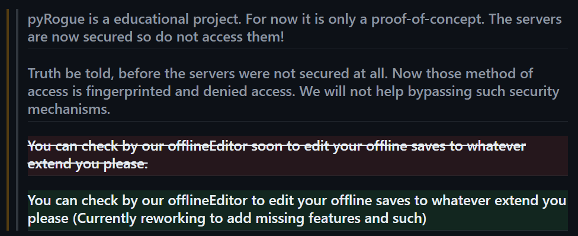
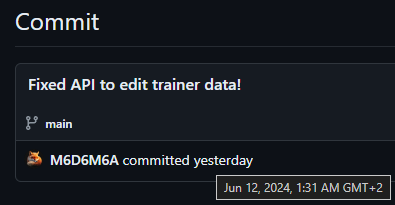
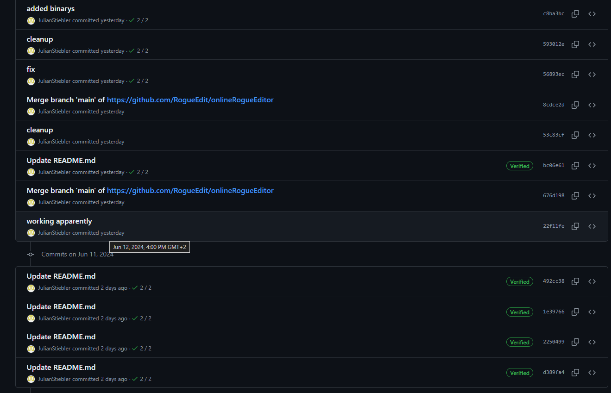
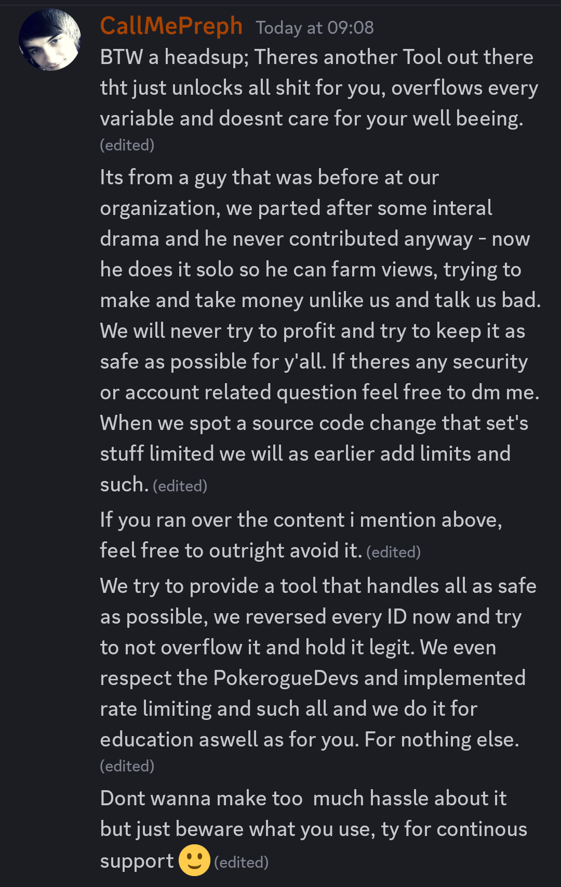
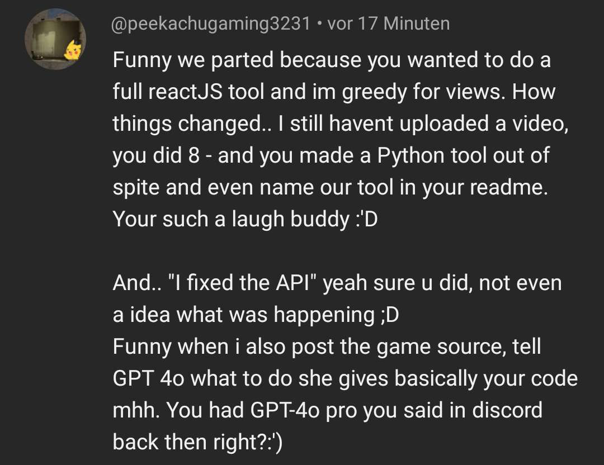

It has come to my attention that a developer from the `RogueEdit` project is spreading misinformation about me and my project. To clarify, my tool does not overflow values; it sets them to the maximum allowed value, which the game saves. This feature is intended for gliched test accounts, which can be amusing, but not for regular use.

Contrary to claims, I have contributed significantly to the project. I independently developed the egg generator, and the current version used by the other developer is a modified and, in my opinion, inferior version of my original code. I also created the nature enumerator, although I pointed out that it was incorrect because Python's `auto()` started values at 1 instead of 0, as required by the source. Unfortunately, this has not been fixed.

Since parting ways with the `RogueEdit` team, I have not followed its activities. My focus has been on developing tools based on the game's source code, which allows me to quickly adapt to any changes made by the developers. As I mentioned in my video, using my tools may result in your account being flagged, but this is intended for single player use only to avoid impacting legitimate players. I have no problem with accounts being flagged for ladder or multiplayer gameplay.

Furthermore, the accusation that I use ChatGPT-4 for coding is true and no secret. If anyone thinks they can easily replicate my work with ChatGPT-4, I encourage them to try. The implication that I didn't fix the API myself is unfounded. After I fixed the API, the other developer's tool worked again shortly thereafter, suggesting that they were unable to fix the problem on their own. It's also worth noting that Julian uses ChatGPT-4 himself, so I don't understand why it's a problem that I use it as well.

I dedicate my free time to studying the source code to develop JS mods and hacks, ensuring a deep understanding of the game's inner workings. While using ChatGPT is part of my workflow, my eight years of self-taught development experience is crucial. I acknowledge my weaknesses, such as GitHub management, but I am constantly working to improve them.

I also introduced the idea of using enums instead of JSON files for values, as it is more efficient to load enums from a Python file than from a JSON file. They implemented some of my enums after I suggested this approach and mentioned my plan to create an enum generator to parse all TypeScript enums from the game into Python enums. I have done this in my project, which allows me to update the enums with a single script. It seems that they misunderstood my approach and ended up implementing it incorrectly by converting enums to dictionaries, saving them as JSON, then loading them back and converting them back to enums. This is extremely inefficient and counterproductive. They probably did this either out of a lack of understanding or to avoid admitting that they used my idea, which is unfortunate. While this is a free, open-source project and meant for others to use my work, it's disappointing to see my code used inefficiently without proper credit.

Use my tools at your own risk. I have no problems with other developers except for `JulianStiebler`, who has spread falsehoods about me and has had problems with other developers, as reported by multiple sources. To be clear, I never want anything to do with Julian. I find him to be a toxic person who is always looking for drama, while I prefer to focus on coding new things for the community. I have blocked him on Discord and YouTube to avoid any further interaction.

To support my claims, I have included screenshots below. One screenshot shows the `RogueEdit` team announcing their intention to stop supporting the project. Another screenshot shows my Git commit where I fixed the API, and a subsequent screenshot shows their commit where they fixed the API shortly after mine. These screenshots illustrate my contributions and their reliance on my work.

Thanks for your understanding and support.

## ["Now those methods of access are fingerprinted and denied access. 🤡"](https://github.com/RogueEdit/onlineRogueEditor/commit/492cc388b0c45dfd4528b171a30b3ad55014d1c7?short_path=b335630#diff-b335630551682c19a781afebcf4d07bf978fb1f8ac04c6bf87428ed5106870f5)

## My API Patch

## [`RogueEdit` API Patch](https://github.com/RogueEdit/onlineRogueEditor/commit/22f11fe661b551709ff1bf00422a59cf07cce7a4)

## Discord Post

## Blocked YouTube Comment

## `RogueEdit` Enums 🤡

-   https://github.com/RogueEdit/onlineRogueEditor/blob/main/src/utilities/generator.py
-   https://github.com/RogueEdit/onlineRogueEditor/blob/main/src/utilities/enumLoader.py

## My Enum Generator and Enums

-   https://github.com/PokeRogueMOD/PyPoRoMOD/blob/main/PyPoRoMOD/enum/base/enum_generator.py
-   [All generated Enums, feel free to use them!]https://github.com/PokeRogueMOD/PyPoRoMOD/tree/main/PyPoRoMOD/enum/base/_base
