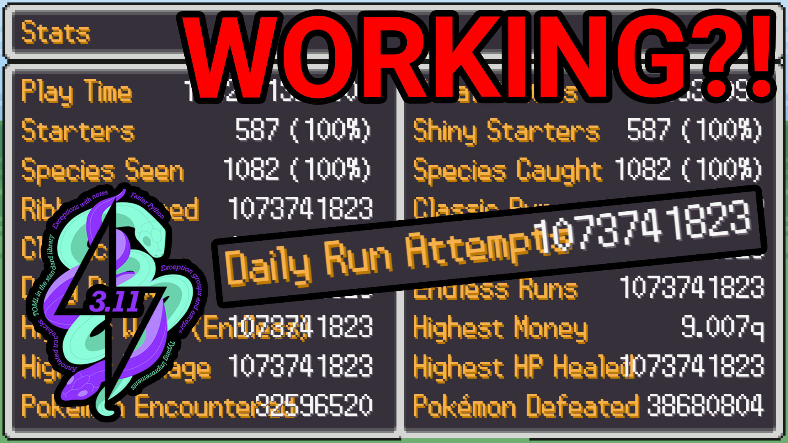

> [!WARNING]  
> **The content of this repo is a proof of concept and is for educational purposes only!**

> [!CAUTION]
> Since there was some unnecessary drama regarding the so-called `RogueEditor`, I decided to just make my own account modification tool from scratch, based only on the [source code](https://github.com/pagefaultgames/pokerogue). My goal is to focus on adding new features that do not exist yet, after I added all base functionalitys, but using custom python classes to ensure I only generate valid data, not exceeding any limits.

# PyPoRoAnal

Welcome to the PyPoRoAnal! This project aims to analyze and modify the account and slot data. I just finished the API and a basic TypeScript to Python translator for Enums. The next step will be adding features, so stay tuned for new updates...

## Features

- [x]   API to interact with the game server (online and local)
- [x]   Account Manager
    - [x]   Add Accounts
    - [x]   Manage Accounts
    - [x]   Create PokeRogue Accounts
- [x]   Account MOD
    - [x]   Export trainer and slots to json
    - [x]   Select and generate eggs without using vouchers, by selecting the tier and gacha type
    - [x]   Hatch all eggs after the next battle
    - [x]   Unlock all starters T3 shiny with all forms and variants
    - [x]   Set high game stats (P)
    - [x]   Set max save to use voucher count
    - [x]   Unlock all gamemodes (Endless, Spliced Endless, Daily)
    - [x]   Unlock all achievements
    - [x]   Unlock all vouchers
    - [x]   Max account with 1 command
    - [ ]   You have to play a game save until wave 2 or 3 to unlock your account if you just created it. I would like to find a solution to also max out new accounts, maybe insert a game save or play it as fast as possible.
    - [ ]   Edit slots (Add items, change pokemon level, enemys, etc.)

## [Video Tutorial](https://youtu.be/768219MdFjA)

## Contact

If you have any questions, suggestions, or need further assistance, feel free to reach out (Discord: mpb.rip).

## License

This project is licensed under the BSD 3-Clause License - see the [LICENSE](LICENSE) file for details.

### Acknowledgments

-   This project uses [Loguru](https://github.com/Delgan/loguru) which is licensed under the MIT License.
